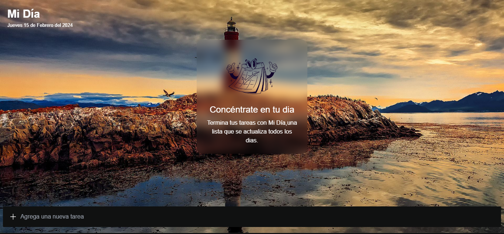
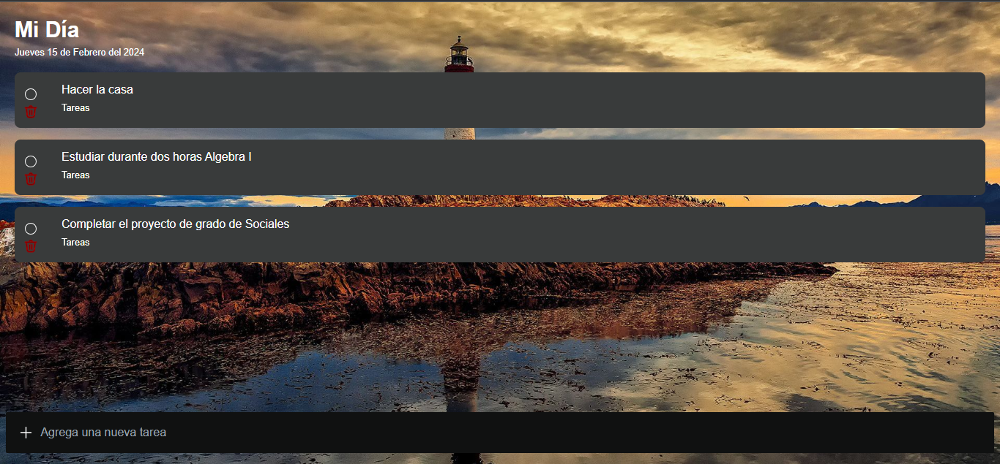
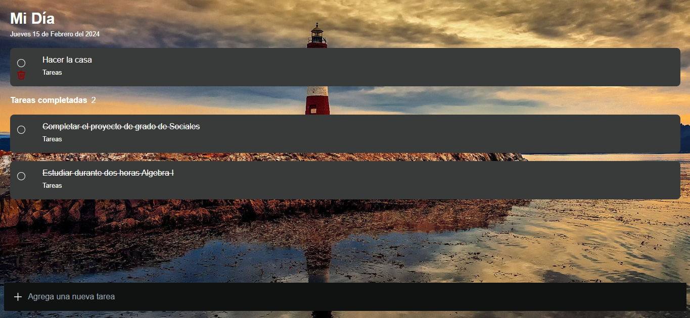

# TodoApp Inspirada en el Diseño de Microsoft

¡Bienvenido a mi TodoApp inspirada en el diseño de escritorio de Microsoft! Esta aplicación de lista de tareas está diseñada para ayudarte a mantenerte organizado y productivo.

## Características Principales

- **Diseño Inspirado en Microsoft:** Me inspiré en el diseño limpio y minimalista de las aplicaciones de Microsoft para crear una interfaz de usuario elegante y fácil de usar.

- **Lista de Tareas Intuitiva:** Agrega fácilmente nuevas tareas, marca las completadas y elimina las que ya no necesitas.

- **Funcionalidades Adicionales:** ¡Pronto añadiré más funcionalidades emocionantes para hacer que tu experiencia con la aplicación sea aún mejor!

## Próximas Funcionalidades

Estas son algunas de las características que planeo añadir en futuras actualizaciones:

- **Categorización de Tareas:** Organiza tus tareas por categorías para una mejor gestión.

- **Recordatorios y Notificaciones:** Configura recordatorios y recibe notificaciones para no olvidar ninguna tarea importante.

- **Colaboración en Tiempo Real:** ¡Trabaja en tus listas de tareas junto con amigos, familiares o compañeros de trabajo en tiempo real!

## Visita la Aplicación

Puedes probar la aplicación en línea aquí: [TodoApp - Demo](https://to-do-app-said00510.vercel.app/)

## Capturas de Pantalla

¡Aquí tienes algunas capturas de pantalla de la aplicación en acción!

## Contribuciones

¡Las contribuciones son bienvenidas! Si tienes ideas para nuevas características o mejoras, no dudes en abrir un problema o enviar una solicitud de extracción.

## Tecnologías Utilizadas

- HTML
- CSS
- JavaScript
- React

## Agradecimientos

¡Un agradecimiento especial a Microsoft por inspirar este proyecto con su diseño elegante y funcional!

